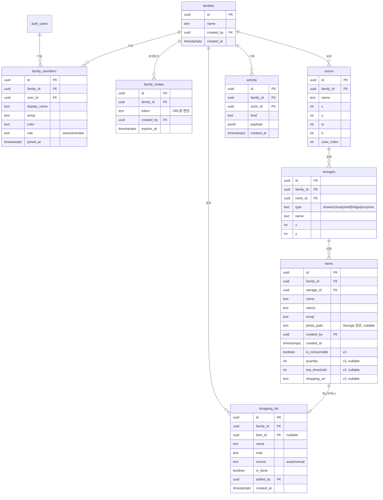

# 홈즈맵 (HOMES MAP) — 웹앱 상세 설계

> 우리집 물건 지도 · 가족이 함께 쓰는 물건 위치 관리 서비스
> 작성일: 2026-07-21 · 상태: 설계(draft) · 기반: `homesmap.html` 프로토타입 v0.1

---

## 1. 개요

### 무엇인가
집 안 어디에 무엇이 있는지를 **집 지도 위에** 기록해두고, "어딨지?"를 검색 한 번으로 해결하는 가족 공유 서비스.

- 방을 그리고 → 방 안에 수납장(서랍장·옷장·냉장고 등)을 놓고 → 수납장에 물건을 등록
- "손톱깎이" 검색 → 어느 방 어느 수납장인지 지도에서 반짝이며 안내
- 가족 누구든 등록/검색, "누가 무엇을 넣었다" 활동 피드로 공유
- **소모품**(건전지·세제·참기름 등)은 재고 수량을 관리해서, 떨어지면 가족 공유 장보기 리스트에 자동으로 올리고 외부 쇼핑몰 구매 링크로 바로 연결

### 해결하는 문제
"그거 어디 뒀더라?"로 온 가족이 서랍을 다 뒤지는 시간 낭비 + "이거 다 떨어진 줄 몰랐네"로 인한 재구매 누락.

### 프로토타입과의 관계
`homesmap.html`이 UI·인터랙션의 기준. 웹앱화의 핵심 변화 두 가지:
1. **영속화 + 진짜 멀티유저** — 메모리 저장 → DB, "멤버 전환" 흉내 → 실제 로그인
2. **소모품 구매 연동** — 프로토타입에 없던 새 축

---

## 2. 범위와 단계 (Phasing)

한 번에 다 만들지 않는다. 각 단계는 독립적으로 배포 가능한 완결된 제품.

| 단계 | 내용 | 목표 |
|---|---|---|
| **v1 — 핵심** | 인증 + 가족/초대 + 지도 에디터 + 물건 등록 + 검색 + 활동 피드 | "우리 가족이 실제로 물건을 등록하고 찾을 수 있다" |
| **v2 — 소모품** | 재고 수량 + 부족 시 장보기 리스트 자동 등록 + 외부 쇼핑몰 링크 | "떨어지기 전에 살 수 있다" |
| **v3 — 다듬기** | 실시간 동기화, 모바일 UX 마감, 성능 | "여러 명이 동시에 써도 매끄럽다" |
| _future_ | AI 이미지 인식(사진→물건 자동 인식), 기타 | 인기 상승 시 확장 (아래 §11) |

이 문서는 **전체 아키텍처 + v1~v2를 상세히**, v3·future는 방향만 남긴다. v1은 별도 구현 계획(implementation plan)으로 이어진다.

---

## 3. 아키텍처

**Next.js (App Router) + Supabase + Vercel** — 기존 lotto_night_sky·dday_manager와 동일 스택, 새 의존성 없음.

```
┌─────────────────────────────────────────────┐
│  Client (Next.js App Router, 반응형)          │
│   - 지도 캔버스 (방/수납장/물건 렌더·편집)      │
│   - 검색, 물건 등록 폼, 장보기 리스트           │
│   - Supabase JS 클라이언트 (auth + data + rt)  │
└───────────────┬─────────────────────────────┘
                │ HTTPS / WebSocket
┌───────────────▼─────────────────────────────┐
│  Supabase                                     │
│   - Auth (카카오 / 구글 / 이메일)              │
│   - Postgres + RLS (가족 단위 격리)            │
│   - Storage (물건 사진, 비공개 버킷)           │
│   - Realtime (v3: 가족 변경 실시간 반영)        │
│   - Edge Functions (future: AI 인식)           │
└─────────────────────────────────────────────┘
        배포: Vercel (Root Directory = web/)
```

**Supabase가 한 번에 해결하는 것**: 인증 / 가족별 데이터 격리(RLS) / 사진 저장 / 실시간 / 서버리스 함수. 별도 백엔드 서버 없음.

**검토했지만 안 고른 것**: Firebase(스택 불일치), 클라이언트-only+localStorage(멀티유저 공유가 핵심이라 탈락), 별도 Node 백엔드(Supabase RLS로 충분해 불필요).

---

## 4. 데이터 모델

### 4.1 ER 다이어그램



### 4.2 프로토타입 → 스키마 매핑

| 프로토타입 | 웹앱 | 비고 |
|---|---|---|
| `state.members[]` | `family_members` 테이블 | "멤버 전환" 제거 → 각자 로그인한 본인이 곧 멤버 |
| `state.rooms[]` | `rooms` | 좌표(x/y/w/h) 그대로, `ci`→`color_index` |
| `state.storages[]` | `storages` | `roomId`→`room_id` FK |
| `state.items[]` | `items` | `by`→`created_by`(실제 유저), `photo`(data URL)→`photo_path`(Storage) |
| `state.activity[]` | `activity` 테이블 | HTML 문자열 저장 대신 `kind`+`payload`로 구조화, 렌더는 클라이언트 |

### 4.3 설계 결정 (deliberate)

- **`family_id`를 storages·items에도 비정규화** — room→storage→item 조인 없이 RLS를 한 홉으로. (트레이드오프: 방 이동 시 하위 family_id 갱신 필요 — 실제로는 방이 가족을 넘나들 일이 없어 무해)
- **활동 피드는 별도 append-only 테이블** — 다른 이벤트 소싱 없이 쓰기 시점에 한 줄 추가. 14개 제한(프로토타입)은 조회 시 `limit`으로.
- **소모품 필드는 items에 nullable 컬럼으로 추가(v2 마이그레이션)** — 별도 테이블로 분리하지 않음. 소모품/비소모품 구분은 `is_consumable` 하나. (YAGNI: 소모품 전용 속성이 늘어나면 그때 분리)
- **좌표는 고정 논리 캔버스(예: 1000 기준) 기준으로 저장** — 뷰포트에 맞춰 스케일/팬. 데스크톱·모바일이 같은 데이터를 공유(§8).

---

## 5. 인증 & 멀티테넌시

### 5.1 인증
Supabase Auth. 제공자: **카카오 · 구글 · 이메일(매직링크)**. 한국 가족 대상이라 카카오가 1순위.

### 5.2 가족(테넌트) 모델
- 회원가입 후 첫 진입 시 **① 새 가족 만들기**(→ owner) 또는 **② 초대 링크로 참여** 중 선택.
- **초대 흐름**: owner가 초대 링크 생성(`family_invites`에 랜덤 token, 유효기간) → 링크 받은 사람이 로그인 → `family_members`에 추가.
- 스키마는 **유저 ↔ 가족 다대다**(`family_members`)를 지원하나, **v1 UI는 "유저당 활성 가족 1개"**로 단순화. (여러 집 관리 니즈가 실제로 생기면 UI만 확장)

### 5.3 RLS 전략
모든 테이블에 `family_id`. 정책은 단일 패턴:

```sql
-- 예: items 조회/수정은 그 가족의 멤버만
create policy "family members can access"
on items for all
using (
  family_id in (
    select family_id from family_members where user_id = auth.uid()
  )
);
```

- `family_members` 자신은 "내가 속한 가족의 멤버 목록만" 조회.
- `family_invites`의 token은 **로그인 전에도 조회 가능해야** 하므로 별도 정책(유효한 token이면 해당 가족명 정도만 노출) 또는 Edge Function 경유.

---

## 6. v1 기능 상세

### 6.1 지도 에디터
프로토타입의 3-모드를 유지: **둘러보기 / 방 그리기 / 수납장 놓기**.

- **방 그리기**: (데스크톱) 드래그로 사각형 → 이름·색 모달. (모바일) §8 참고.
- **수납장 놓기**: 종류 선택 후 방 안쪽 탭/클릭 → 배치. 방 밖이면 안내 토스트.
- **삭제**: 방 삭제 시 하위 수납장·물건 연쇄 삭제(프로토타입 `deleteRoom` 동일, DB는 `on delete cascade`).
- 렌더는 프로토타입 로직 이식하되 React 컴포넌트로 분해: `<MapCanvas>`, `<Room>`, `<Storage>`, `<DetailPanel>`, `<SearchBar>`.

### 6.2 물건 등록 (draft → 확인 → 저장)
수납장 상세 패널에서 이름·메모·사진 입력 → 등록. 등록 시:
- 사진이 있으면 Supabase Storage 업로드 → `photo_path` 저장(§9).
- `activity`에 "누가 어디에 무엇을 등록" 한 줄 추가.
- **등록 흐름을 "draft 배열 → 확인 → 일괄 insert"로 추상화** → future AI 인식이 이 앞단에 그대로 꽂힘(§11). v1에서는 draft가 항상 1건.

### 6.3 검색
- v1은 **클라이언트 필터**(현재 로드된 items에서 이름·메모 부분일치, 상위 8건). 프로토타입과 동일.
- 결과 클릭 → 해당 수납장 열고 지도에서 방 glow + 수납장 pulse 애니메이션.
- (물건이 수백 개를 넘어 느려지면 그때 Postgres `ilike`/full-text로 이관 — YAGNI)

### 6.4 활동 피드
`activity` 최근 N건 조회 → 프로토타입과 동일한 "이모지 + 누가 + 무엇" 표시. 렌더는 `kind`+`payload`로 클라이언트에서 조립(HTML 저장 안 함, XSS 안전).

---

## 7. v2 기능 상세 — 소모품 & 구매 연동

### 7.1 소모품 물건
물건 등록/수정 시 **"소모품으로 관리" 토글**. 켜면:
- `quantity`(현재 재고), `low_threshold`(이 이하면 부족), `shopping_url`(외부 구매 링크) 입력.
- 수납장 상세에서 소모품은 수량 +/- 버튼으로 빠르게 조정("하나 썼어요").

### 7.2 재고 부족 → 장보기 리스트 자동 등록
- `quantity <= low_threshold`가 되는 순간, `shopping_list`에 `source='auto'`, `item_id` 연결로 자동 추가.
- 이미 리스트에 있으면 중복 추가 안 함. 재고를 다시 채우면(임계 초과) 자동 항목은 리스트에서 내려감(또는 완료 처리).
- 판정 위치: **DB 트리거 또는 앱 로직 중 택1**. → v2 초안은 **앱 로직**(items 갱신 시 클라이언트/서버 액션에서 처리)로 시작, 경합이 문제되면 트리거로 이관. (`ponytail:` 단순한 앱 로직 우선, 동시성 이슈 시 DB 트리거로 승격)

### 7.3 가족 공유 장보기 리스트
- 별도 화면: 미완료 항목 목록(자동/수동 혼합), 체크 시 완료.
- 수동 추가도 가능(`source='manual'`, item 연결 없이 이름만).
- 각 항목에 연결된 `shopping_url` 있으면 **"사러 가기" 버튼** → 외부 쇼핑몰 새 탭. (제휴 링크로 수익화 여지 — 링크만 심으면 됨, 결제/장바구니 API 연동 아님)

### 7.4 비범위(v2에서 안 함)
- 앱 내 실제 결제/체크아웃 ❌
- 소비 주기 예측·재구매 알림(주기 기반) ❌
- 가계부/지출 분석 ❌

---

## 8. 반응형 / 모바일 UX

주 사용: **데스크톱=초기 지도 설정, 모바일=일상 검색·등록·장보기**.

- **공유 좌표계**: 방/수납장은 고정 논리 캔버스 좌표로 저장. 뷰는 컨테이너 크기에 맞춰 scale + pinch/드래그 팬.
- **데스크톱**: 프로토타입 그대로 — 드래그로 방 그리기, 3단 레이아웃(도구/지도/상세).
- **모바일**:
  - 레이아웃 1단화 — 상단 검색 + 지도(전체폭) + 상세는 바텀시트, 도구는 하단 탭/FAB.
  - 방 그리기: 드래그 대신 **"방 추가" → 기본 크기 사각형 배치 후 핸들로 크기·위치 조정** (터치 친화). 초기 설정은 데스크톱 권장 안내.
  - 수납장 놓기·물건 등록·검색은 탭 기반이라 모바일에서 그대로 자연스러움.
- v1은 데스크톱 완성 + 모바일 "조회/등록/검색/장보기" 사용 가능 수준, 모바일 방 그리기 마감은 v3.

---

## 9. 사진 저장

- Supabase Storage **비공개 버킷** `item-photos`, 경로 `{family_id}/{item_id}/{uuid}.jpg`.
- 업로드: 클라이언트에서 리사이즈/압축(과대 용량 방지) 후 업로드 → `items.photo_path` 저장.
- 표시: 서명 URL(signed URL) 발급 또는 RLS 연동 접근. data URL(프로토타입) 대비 DB 비대화·성능 문제 해소.

---

## 10. 실시간 동기화 (v3)

- Supabase Realtime로 `items`·`storages`·`rooms`·`shopping_list`·`activity`를 가족 채널 구독.
- 다른 가족원이 물건 등록/재고 변경 시 내 화면 즉시 반영, 활동 피드 실시간 갱신.
- v1~v2는 **화면 진입/새로고침 시 최신 로드**로 충분(가족 규모 동시 편집 빈도 낮음). 실시간은 UX 마감 단계에서.

---

## 11. 미래 확장 — AI 이미지 인식 (지금은 미구현)

**지금 스택/스키마에 아무것도 추가하지 않는다.** 이유: 이 기능은 "사진 → 물건 후보 목록 → 사용자 확인 → 평소처럼 등록"이라 **§6.2 물건 등록의 앞단에 끼우는 단계**일 뿐.

미래 구현 시:
1. 서랍 사진 업로드 → Supabase Edge Function이 Claude 비전 API 호출.
2. 인식된 물건 이름들을 **draft 배열**로 반환.
3. 사용자가 확인/수정 → §6.2의 일괄 insert 경로로 저장.

남겨둘 이음새는 **"물건 등록을 draft→확인→저장 흐름으로 만들어 둔다"** 하나뿐. 인프라·컬럼 추가 불필요.

---

## 12. 전체 비범위 (Out of Scope)

- 앱 내 결제/커머스, 재고 자동 발주
- 소비 주기 예측 알림
- 웹앱 외 네이티브 앱, 오프라인 우선(offline-first)
- 물건 대여/공유 등 가족 외부 기능

---

## 13. 열린 질문 / 결정 필요

구현 계획 전에 확정하면 좋은 것들 (기본값 제안 포함):

1. **초대 방식** — 링크 공유만으로 충분? 아니면 6자리 코드도? _(제안: 링크 우선, 코드 나중)_
2. **활동 피드 보관량** — 최근 며칠/몇 건까지? _(제안: 최근 50건 조회)_
3. **소모품 수량 단위** — 개수만? 아니면 "롤/병/팩" 같은 단위 텍스트? _(제안: v2는 개수만, 단위는 나중)_
4. **가족 1인당 가족 수** — v1은 1개 고정 UI로 시작 확정? _(제안: 예)_
5. **프로젝트 위치** — 배포는 기존 패턴대로 Root Directory=`web/`? _(제안: 예, 기존 동일)_

---

## 부록 A. 프로토타입 참조
- 소스: `homesmap.html` (v0.1, 인메모리)
- 재사용 가능한 것: 색상 토큰·레이아웃 CSS, 지도 렌더/드래그 로직, 검색·플래시 애니메이션, 수납장/방 상호작용 → React 컴포넌트로 이식
- 버릴 것: 인메모리 `state`, "멤버 전환" UI(실제 로그인으로 대체), data URL 사진(Storage로 대체)
